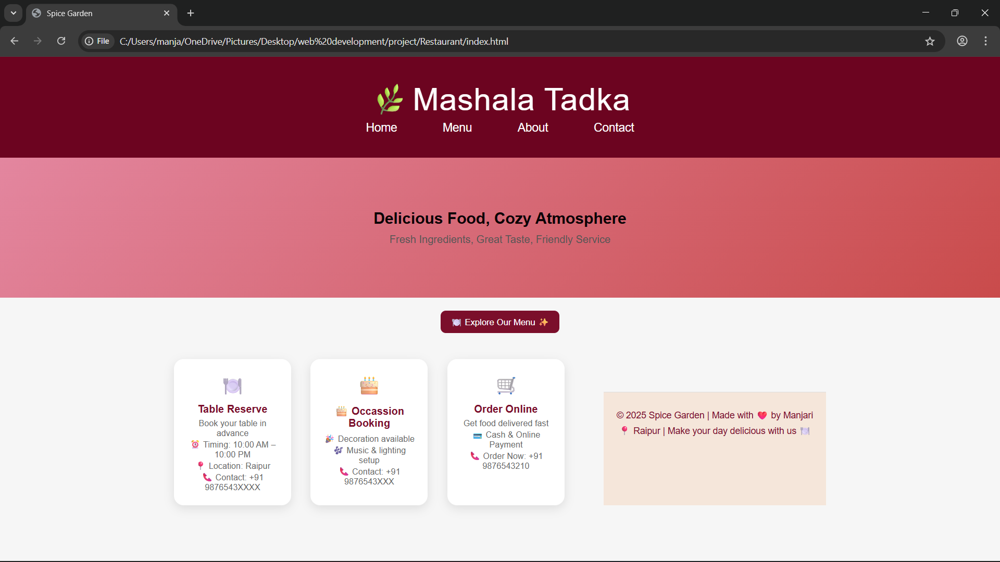
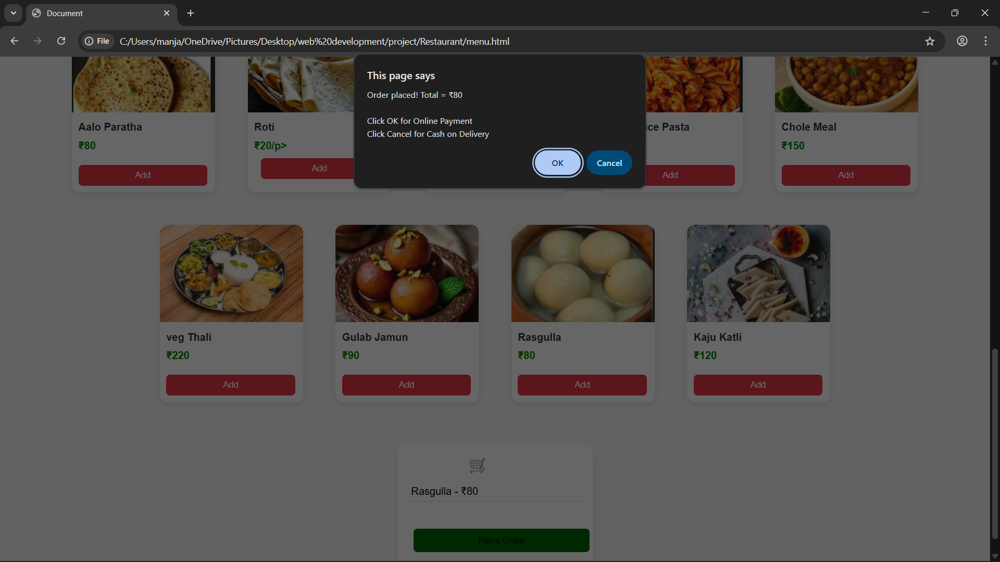

# Mashala-Tadka-Restaurant
Restaurant Website (Mashala Tadka) A responsive and user-friendly restaurant website developed using HTML, CSS, and JavaScript. The website allows users to view menu items, explore dishes, and place orders online. It includes an attractive UI with smooth navigation and a modern design to enhance user experience

### project images

###frontpage

###order

###
order page
![order page}(order page.png)
